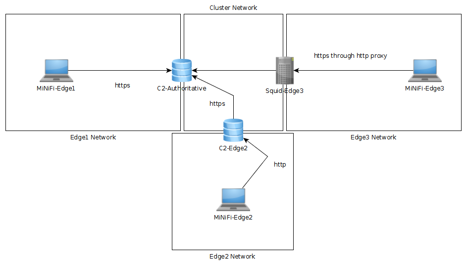

<!--
  Licensed to the Apache Software Foundation (ASF) under one or more
  contributor license agreements.  See the NOTICE file distributed with
  this work for additional information regarding copyright ownership.
  The ASF licenses this file to You under the Apache License, Version 2.0
  (the "License"); you may not use this file except in compliance with
  the License.  You may obtain a copy of the License at
      http://www.apache.org/licenses/LICENSE-2.0
  Unless required by applicable law or agreed to in writing, software
  distributed under the License is distributed on an "AS IS" BASIS,
  WITHOUT WARRANTIES OR CONDITIONS OF ANY KIND, either express or implied.
  See the License for the specific language governing permissions and
  limitations under the License.
-->
## Apache NiFi MiNiFi Command and Control (C2) Server
MiNiFi agents allow us to push data flows down to smaller devices on the edge of the network.  This provides many of the niceties of processing data with NiFi in a smaller package.  One big challenge with many disparate agents running on all sorts of devices is coordinating their work and pushing out revised flows.

The C2 server is the beginning of an attempt to address this usecase.  It provides an endpoint for existing PullHttpChangeIngestor functionality that is intended to facilitate distributing appropriate flow definitions to each class of agent.

In the assumed usecase one or more class of MiNiFi agent polls the C2 server periodically for updates to its flow.  When there is a new version available, the C2 server will send it back to the agent at which point the agent will attempt to restart itself with the new flow, rolling back if there is a problem starting.

The C2 server is intended to be extensible and flexibly configurable.  The ConfigurationProvider interface is the main extension point where arbitrary logic should be able to be used to get updated flows.  The server supports bidirectional TLS authentication and configurable authorization.

### Usage
After building, extract minifi-c2/minifi-c2-assembly/target/minifi-c2-VERSION-bin.tar.gz into a directory.

./bin/c2.sh or ./bin/c2.bat will start the server.

[./conf/c2.properties](./minifi-c2-assembly/src/main/resources/conf/c2.properties) can be used to configure the listening port, tls settings.

[./conf/minifi-c2-context.xml](./minifi-c2-assembly/src/main/resources/conf/minifi-c2-context.xml) can be configured according to the [configuration provider examples below](#configuration-providers) to retrieve configuration payloads from the appropriate provider.

[./conf/authorities.yaml](./minifi-c2-assembly/src/main/resources/conf/authorities.yaml) determines the authority or authorities (arbitrary string value) to assign to requesters based on their DN.

[./conf/authorizations.yaml](./minifi-c2-assembly/src/main/resources/conf/authorizations.yaml) is used to determine whether to allow access based on a requester's authorities.

When using the CacheConfigurationProvider, the server will by default look for files in the ./files/ directory to satisfy requests.  It will resolve the correct file using the query parameters and content type provided to it and then serve up either the requested version if specified in the query parameters or the latest if unspecified.

The pattern can be configured in [./conf/minifi-c2-context.xml](./minifi-c2-assembly/src/main/resources/conf/minifi-c2-context.xml) and the default value (${class}/config) will replace ${class} with the class query parameter and then look for CLASS/config.CONTENT_TYPE.vVERSION in the directory structure.

Ex: http://localhost:10080/c2/config?class=raspi&version=1 with an Accept header that matches text/yml would result in [./files/raspi3/config.text.yml.v1](./minifi-c2-assembly/src/main/resources/files/raspi3/config.text.yml.v1) and omitting the version parameter would look for the highest version number in the directory.

The version resolution is cached in memory to accommodate many devices polling periodically.  The cache duration can be configured with additional arguments in  [./conf/minifi-c2-context.xml](../minifi-integration-tests/src/test/resources/c2/hierarchical/c2-edge2/conf/minifi-c2-context.xml#L55) that call the [overloaded constructor.](./minifi-c2-service/src/main/java/org/apache/nifi/minifi/c2/service/ConfigService.java#L81)

MiNiFi Java agents can be configured to poll the C2 server by [configuring the PullHttpChangeIngestor in their bootstrap.conf.](../minifi-integration-tests/src/test/resources/c2/hierarchical/minifi-edge1/bootstrap.conf#L37)

### Configuration Providers:
There are three ConfigurationProvider implementations provided out of the box.
1. The [CacheConfigurationProvider](./minifi-c2-assembly/src/main/resources/conf/minifi-c2-context.xml) looks at directory on the filesystem.
2. The [DelegatingConfigurationProvider](./minifi-c2-integration-tests/src/test/resources/c2-unsecure-delegating/conf/minifi-c2-context.xml) delegates to another C2 server to allow for hierarchical C2 structures to help with scaling and/or bridging networks.
3. The [NiFiRestConfigurationProvider](./minifi-c2-integration-tests/src/test/resources/c2-unsecure-rest/conf/minifi-c2-context.xml) pulls templates from a NiFi instance over its REST API. (Note: sensitive values are NOT included in templates so this is unsuitable for flows with sensitive configuration currently)

### Example network diagram:
Below is a network diagram showing the different configurations tested by [our hierarchical integration test docker-compose file.](../minifi-integration-tests/src/test/resources/docker-compose-c2-hierarchical.yml)  It consists of a "cluster" network where real processing might occur as well as 3 "edge" networks that can get configuration from the cluster network a few different ways.  The edge1 instance can directly access the authoritative C2 server via HTTPS.  The edge2 instance is representative of a segmented network where the MiNiFi agents can talk to a local delegating C2 server over HTTP which asks the authoritative C2 server over HTTPS.  The edge 3 instance can talk to the authoritative C2 server through a Squid proxy over HTTPS.

